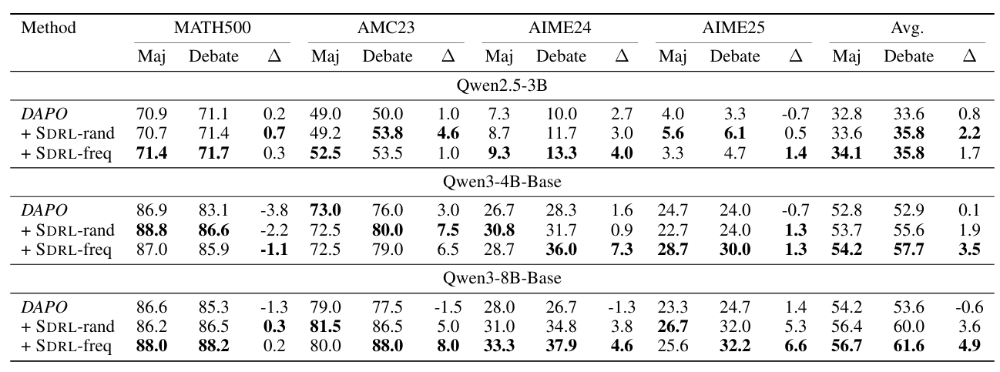
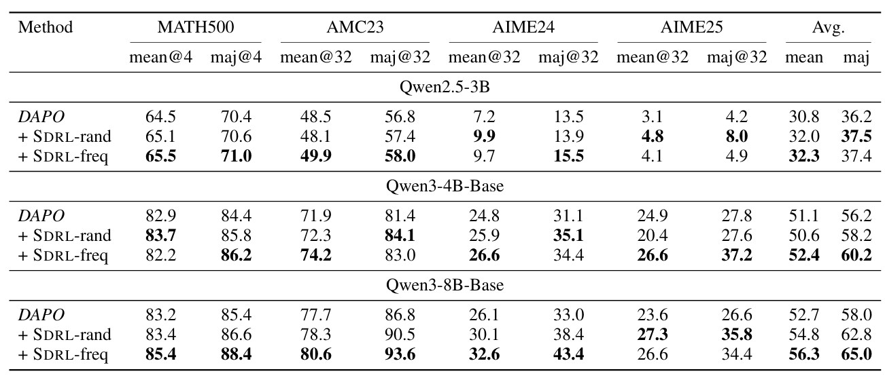

# Self-Debate Reinforcement Learning (SDRL)

This is the official repo for [Learning from Self-Debate: Preparing Reasoning Models for Multi-Agent Debate](https://arxiv.org/pdf/2601.22297).

## Introduction

Large reasoning models are commonly post-trained with reinforcement learning from verifiable rewards (RLVR), but standard RLVR trains models to solve each problem in isolation. At test time, however, Multi-Agent Debate (MAD) can improve reasoning by letting several agents propose, compare, and revise solutions. This creates a mismatch: a model that is only optimized for single-trajectory problem solving may not be prepared to evaluate diverse peer rationales or recover from conflicting reasoning paths during debate.

**Self-Debate Reinforcement Learning (SDRL)** is an online reinforcement learning framework that trains a single model to be both a strong standalone solver and an effective debate participant. Given a prompt, SDRL samples multiple candidate solutions from the current policy, constructs debate contexts from diverse reasoning trajectories, generates second-turn responses conditioned on those contexts, and jointly optimizes both the initial and debate-conditioned responses with verifiable rewards. In `SDRL-freq`, the debate context is built by selecting candidate responses associated with the most common and second most common answers from the initial rollout pool, exposing the model to the dominant competing beliefs produced by its own policy.

The central idea is to train the model's *private critique* ability: when the model sees multiple candidate rationales, it should learn to distinguish reliable reasoning from flawed trajectories and revise only when the evidence supports revision. The paper also provides a theoretical analysis that separates the effects of majority voting and private critique in MAD, explaining why debate often improves performance in early rounds but can saturate or decline as agents become more correlated.

## Main Results

### Multi-Agent Debate

SDRL improves decentralized multi-agent debate across Qwen2.5-3B, Qwen3-4B-Base, and Qwen3-8B-Base on MATH500, AMC23, AIME24, and AIME25. In the main 5-agent, one-round MAD setting, SDRL raises both the quality of the initial response pool and the post-debate accuracy compared with the DAPO baseline.

<p align="center">

</p>

### Single-Agent Reasoning

SDRL also strengthens standalone reasoning, showing that debate-oriented training does not only help at test time in a multi-agent system. By jointly optimizing first-pass and debate-conditioned responses, SDRL improves direct response quality and majority-vote performance for single models.

<p align="center">

</p>

## Getting Started

### Installation

Create and activate the conda environment:

```bash
conda create -n SDRL python==3.12
conda activate SDRL
```

Install the inference and training dependencies:

```bash
pip install -r requirements-sdrl.txt
```

Install SDRL in editable mode:

```bash
pip install --no-deps -e .
```

Log in to W&B and Hugging Face:

```bash
wandb login
huggingface-cli login
```

### Data Preparation
run `python train_scripts/prepare-data.py` to download and preprocess data.
The original data are [DAPO-Math-17k](https://huggingface.co/datasets/open-r1/DAPO-Math-17k-Processed), [MATH500](https://huggingface.co/datasets/HuggingFaceH4/MATH-500), [AMC23](https://huggingface.co/datasets/math-ai/amc23), [AIME24](https://huggingface.co/datasets/BytedTsinghua-SIA/AIME-2024), [AIME25](https://huggingface.co/datasets/math-ai/aime25).
For 8B models debate on AIME benchmarks, we use YaRN for longer responses length. Change the config.json:
```
"max_position_embeddings": 65536,
"rope_scaling": {
       "rope_type": "yarn",
      "factor": 2.0,
      "original_max_position_embeddings": 32768},
```

### Training

Run training scripts from the repository root.

| Model | Setting | Script |
| --- | --- | --- |
| Qwen2.5-3B | SDRL-freq | `train_scripts/qwen2.5/SDRL-freq-qwen2.5-3b.sh` |
| Qwen2.5-3B | SDRL-rand | `train_scripts/qwen2.5/SDRL-rand-qwen2.5-3b.sh` |
| Qwen3-4B-Base | SDRL-freq | `train_scripts/qwen3/SDRL-freq-qwen3-4B.sh` |
| Qwen3-4B-Base | SDRL-rand | `train_scripts/qwen3/SDRL-rand-qwen3-4B.sh` |
| Qwen3-8B-Base | SDRL-freq | `train_scripts/qwen3/SDRL-freq-qwen3-8B.sh` |
| Qwen3-8B-Base | SDRL-rand | `train_scripts/qwen3/SDRL-rand-qwen3-8B.sh` |

For example, to run SDRL-freq with Qwen3-4B-Base:

```bash
bash train_scripts/qwen3/SDRL-freq-qwen3-4B.sh
```

### Evaluation

We adopt [debate-or-vote](https://github.com/deeplearning-wisc/debate-or-vote) for evaluation of multi-agent debate.

### Acknowledgements

SDRL is implemented on top of [verl](https://github.com/volcengine/verl).
